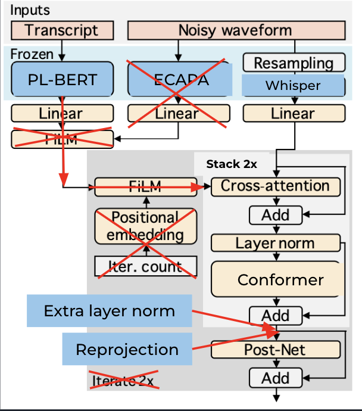

# miipher2.0
Miipher2.0 is a custom implementation of the feature cleaner seen in [Miipher](https://arxiv.org/pdf/2303.01664.pdf) developed by Google to help restore degraded speech. It was used in the creation of LibriTTS-R. **We do not implement the vocoder and use an inhouse whisper-to-wav vocoder**.

## Methodology
There are 3 components that Miipher uses that we need to replace: 
- PNG-BERT - represents linguistic information 
- custom Conformer-based speaker encoder - conditioned to preserve speaker identity
- w2v-BERT - robust speech embeddings

We chose [PL-BERT](https://github.com/yl4579/PL-BERT) in palce of PNG-BERT, [ECAPA-TDNN](https://catalog.ngc.nvidia.com/orgs/nvidia/teams/nemo/models/ecapa_tdnn) in place of their custom speaker encoder, and [Whisper](https://github.com/openai/whisper) embeddings in place of w2v-BERT.

We do not implement the fixed point iteration of the paper.

## Implementation Details
We had to tweak the architecture a bit (scaled down) for better results, but we believe on the right dataset and right set of hyperparameters, this model will have better results. Here is what the current successful architecture looks like: 

We ignore the speaker identity aspect, feed the PL-BERT embeddings directly to the cross attention, and only stack 2x.

## Usage
The om
